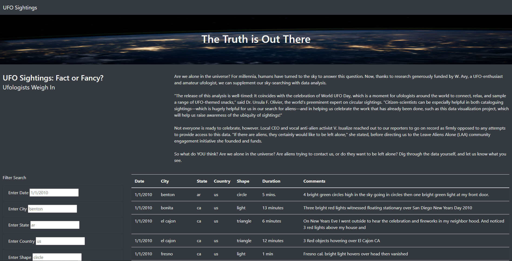

# UFO Sightings: The Truth is Out There

## Project Overview

A website the allows users to filter for multiple criteria at he same time on the UFO Sightings data.js file. This file contains many entries consisting of the fields; Date, City, State, Country, Shape, Duration and Comments. Any of these fields can accept values and will filter the table based on the user input.

## Resources

- Data Source: data.js
- Software: Visual Code Studio 1.51, Atom 1.52.0 x64, Google Chrome

## Results

- To perform a search, the user types an input in any or all of the five text boxes that you see on the image of the webpage bellow. By default, the entire table is populated on the page and you can scroll down the page to see the entries.

- In the example bellow the Country text box was populated with 'ca' to filter all entries for Canada. When you enter any inputs you also have to hit enter to activate the script.

## Summary

- A drawback of the website is the all the data is first presented on the page and you don't really know the filter options in each field unless you scroll through the entire table and take note.

- The first recommendation would be to create a selection dropdown instead of text boxes. This way the user could select from the entries that actually exist in the table.

- Another recommendation would be to create an error checker for the text boxes so that the format of each field had to be entered in a certain way. 
